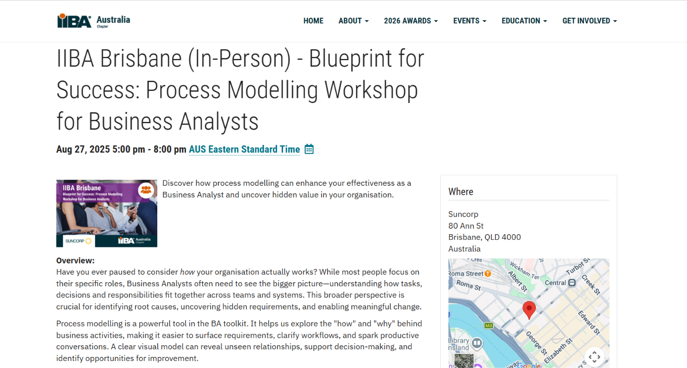
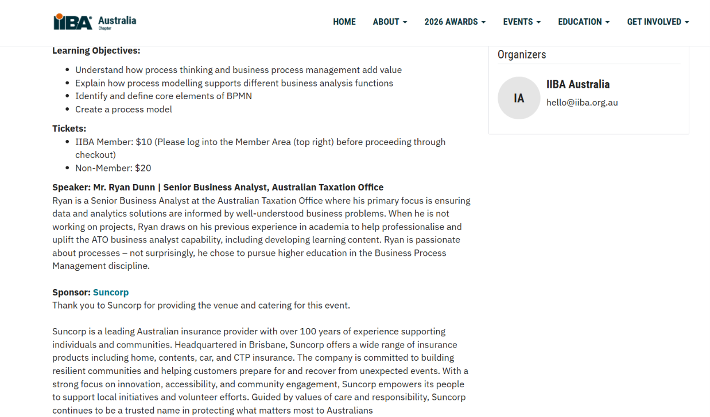
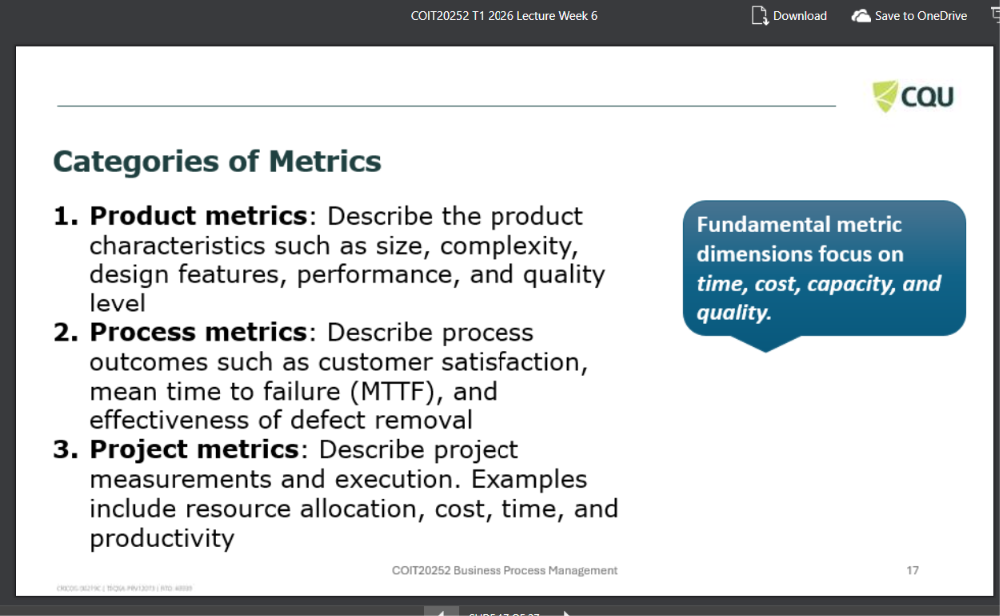

# Business-Process-Modelling
## Week 5-Artifact 5
### Artifact Title: Selecting Appropriate Participants for Process Modelling
### Screenshot of the IIBA Australia 2025 Process-Modelling Workshop webpage

### Reflection
#### For this week, I have selected Tutorial Question 5.5 and an IIBA Australia webpage about a 2025 process-modelling workshop as my artefact which
explains that modelling requires understanding how tasks, decisions and responsibilities operate across teams and systems (IIBA Australia, 2025). Suitable
participants should therefore be chosen for their process knowledge, decision authority, practical experience, stakeholder impact and technical expertise.
This artefact showed me that modelling depends on combining viewpoints. Process owners clarify objectives and approve changes, frontline employees explain
working practices, customers identify service problems, business analysts structure the model, and technical specialists assess system constraints. I would
involve these participants through workshops, resolve disagreements using process evidence and collectively validate the model. This would reveal bottlenecks and
exceptions while improving accuracy, stakeholder acceptance and implementation success.

### References
#### IBA Australia (2025) ‘IIBA Brisbane: Blueprint for Success—Process Modelling Workshop for Business Analysts’, International Institute of Business Analysis
Australia Chapter, 27 August. Available at: https://australia.iiba.org/Events/iiba-brisbane-%28in-person%29-blueprint-for-success-process-modelling-workshop-for
business-analysts

## Week 6-Artifact 6
### Artifact Title: Categories of Business Process Performance Metrics
### Screenshot of Slide 17 from the Week 6 lecture slides

### Reflection
#### For this week, I have selected Slide 17, “Categories of Metrics,” from the Week 6 lecture material as my artefact. The slide distinguishes product, process
and project metrics. Product metrics examine characteristics such as size, complexity, performance and quality; process metrics assess outcomes including
customer satisfaction and defect removal; and project metrics measure cost, time, productivity and resource allocation. These categories demonstrate how
organisations evaluate different dimensions of performance (CQUniversity, 2026, slide 17). This artefact showed that performance cannot be judged through one
measure. In hotel room cleaning, product metrics could assess room quality; process metrics could measure cleaning time and guest satisfaction; and project
metrics could monitor labour cost and staff allocation. Comparing them would reveal whether poor performance results from service quality, inefficient activities
or insufficient resources. Managers could then prioritise improvements and monitor benefits.
### References
#### CQUniversity (2026) COIT20252 Business Process Management – Week 6: Process Design and Process Performance Measurement, lecture slides, slide 17.
## Week 7-Artifact 7
### Artifact Title: Digital Transformation of the Hotel Room-Readiness Process
### Before-and-after model of the hotel room-readiness process

### Reflection
#### For this week, I have selected a before-and-after model of the hotel room-readiness process. The current process relies on phone calls and manual room
status updates, which can delay task allocation and communication with reception. I would adopt process transformation by introducing a mobile housekeeping
system that assigns rooms automatically, records live status and alerts reception immediately when inspection is complete. This artefact shows how digital
transformation changes technology and workflow. Hospitality technology can automate operations and improve organisational performance (Hernández-Laroche and Lee,
2025, p. 1). Real-time information could reduce waiting, repeated communication and inaccurate room status, supporting faster check-in. However, staff training,
system reliability and privacy controls are necessary. In future ICT roles, I could map delays, design improvements and compare turnaround time and errors before
any final implementation.

### References
#### Hernández-Laroche, A. and Lee, M. (2025) ‘Hospitality and tourism technology and organizational performance: An integrated framework of HTT business value
and future research agenda’, International Journal of Hospitality Management, 126, article 104092. doi: 10.1016/j.ijhm.2025.104092.
