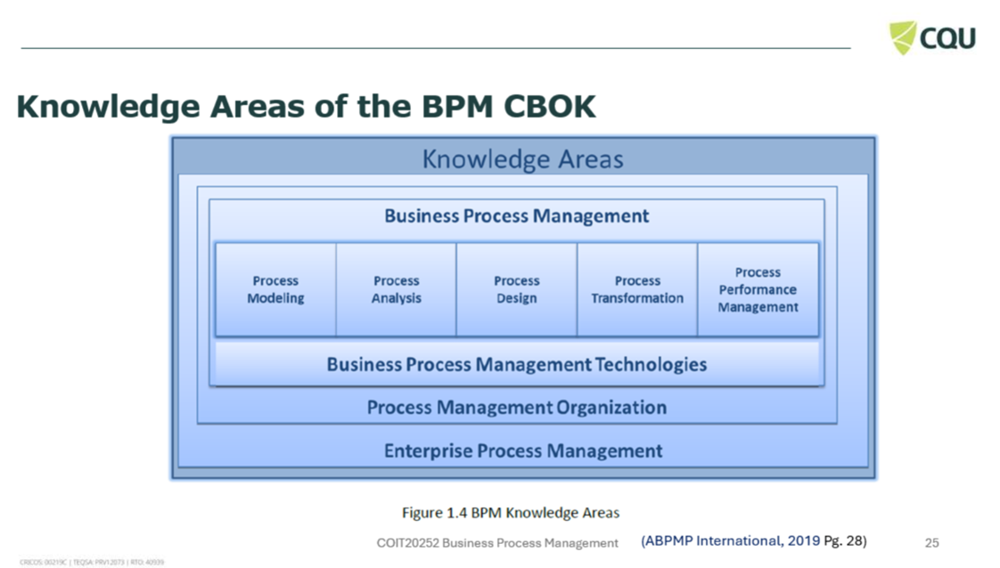
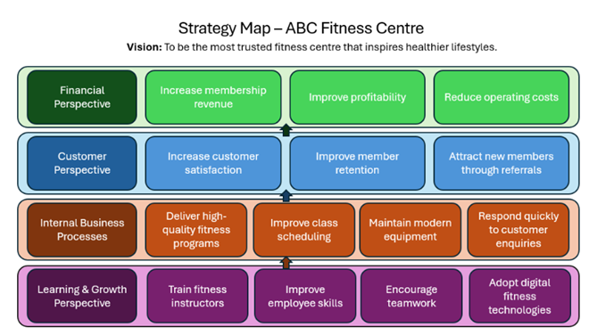
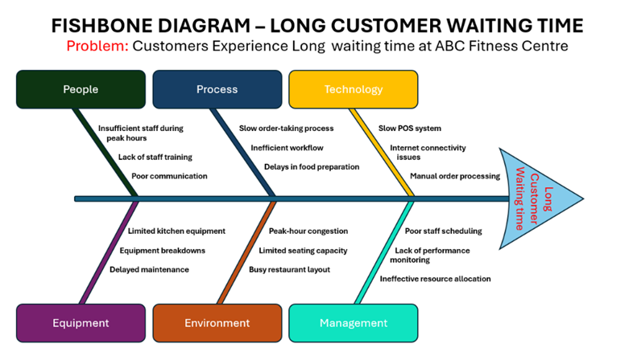

# PROCESS ANALYSIS
## WEEK 1-Artefact 1
### Artefact Title: Knowledge Areas of the BPM CBOK
### Screenshot of Slide 25 from Lecture slides

### REFLECTION
### Description
#### I have selected my first artefact from the lecture slides of Week 1, "The BPM Professional and BPM CBOK." And it introduces the Business Process Management Common Body of Knowledge (BPM CBOK), which provides a systematic framework of knowledge areas required for impactful Business Process Management. During this week's lecture, I learned that the BPM CBOK is a globally acknowledged reference that enables organisations and professionals understand the principles, methods and practices used to strengthen business processes. As well as the lecture also highlights that understanding these knowledge areas is one of the key learning outcomes for the week.
### Analysis 
#### After learning about the BPM CBOK, I have realised that BPM is a much broader management discipline then just creating process diagrams and documenting workflows as I thought before. And it involves identifying, designing, executing, monitoring and continuously improving business processes so that they align with an organisation's strategic goals. The BPM CBOK also highlighted that rather just relying on the technical modelling skills, successful process improvement requires knowledge from multiple areas which changed my understanding of the role of a BPM professional. Instead of simply drawing process models, a BPM professional must understand organisational objectives, analyse existing processes, identify opportunities for improvement and support organisational change and I found this particularly interesting because it demonstrates how business knowledge and technical knowledge complement each other when solving organisational problems.
### Evaluation
#### As it explained the broader purpose of Business Process Management, this artefact provided me with a strong foundation for the rest of the unit advanced topics such as process analysis and business modelling. Also, it helped me to appreciate that process improvement is an ongoing activity which requires continuous monitoring and evaluation rather than a one-time project. As a Master of Information Systems student, I believe this learning will be valuable in my future career because many ICT roles require collaboration with business stakeholders to improve organisational processes. Understanding the BPM CBOK has encouraged me to think beyond technical solutions and consider how process management contributes to organisational efficiency, customer value and strategic success. I intend to apply these principles in future coursework and professional projects by analysing business problems systematically before proposing technological solutions.
### References
#### ABPMP International. (2019). BPM CBOK® Version 4.0: Guide to the Business Process Management Common Body of Knowledge. Association of Business Process Management Professionals. CQUniversity. (2026). COIT20252 Business Process Management – Week 1 Lecture Slides.

## WEEK 2-Artefact 2
### Artifact Title: Strategy Map for ABC Fitness Centre
### Diagram of Strategy Map

### REFLECTION
### Description
#### I have developed a strategy map for this week's artefact for a fictional organisation called ABC Fitness Centre. And the purpose of this activity was to understand how organisational strategy can be translated into clear business objectives that support Business Process Management (BPM). I organised the business objectives into four perspectives: Financial, Customer, Internal Business Processes, and Learning & Growth while creating the strategy map. And this exercise demonstrated how different parts of an organisation work together to achieve long-term success and sustainable business performance.
### Analysis
#### My last week learning was focused on understanding the foundations of BPM and the BPM CBOK but this activity required me to apply those concepts in a practical setting as by developing the strategy map helped me recognise that organisational success is achieved when business processes are aligned with strategic objectives. Along with that, I have realised that employee development improves internal processes, efficient processes increase customer satisfaction, and satisfied customers contribute to stronger financial outcomes. And another important insight was that organisations should not focus only on increasing profits because long-term success depends on balancing financial performance with customer value, operational efficiency, and continuous learning. Creating the strategy map strengthened my understanding of how Business Process Management supports strategic planning by ensuring that business processes contribute to organisational goals rather than operating independently.
### Evaluation 
#### Developing the strategy map enhanced my ability to think strategically about business operations and process improvement. This activity demonstrated that successful organisations require clear objectives that are connected across different business areas. As well as it highlighted the importance of aligning organisational strategy with process management to achieve sustainable growth and competitive advantage. Ans as a future ICT professional, I believe this knowledge will help me analyse business requirements more effectively and recommend technology solutions that support organisational objectives. Overall, this activity increased my confidence in applying Business Process Management concepts to real-world situations and demonstrated the practical value of strategic thinking in organisational improvement.
### References
#### Association of Business Process Management Professionals (ABPMP). (2019). BPM CBOK® Version 4.0: Guide to the Business Process Management Common Body of Knowledge. Association of Business Process Management Professionals. CQUniversity Australia. (2026). COIT20252 Business Process Management – Week 2 Lecture Materials.

## Week 3-Artefact 3
### Artifact Title: Root Cause Analysis (Fishbone Diagram) for Customer Waiting Time
### Fishbone Diagram – Self-created using PowerPoint

### REFLECTION
### Description
#### For this week's artefact, I created a Fishbone Diagram, also known as an Ishikawa Diagram, to perform a Root Cause Analysis (RCA) of the problem of long customer waiting time in a restaurant. This activity was based on the Week 3 topic of Process Analysis and helped me understand that solving business problems requires identifying their underlying causes rather than only addressing visible symptoms. By categorising the possible causes into People, Process, Technology, Equipment, Environment and Management, I was able to analyse the problem in a structured and systematic manner.
### Analysis
#### As compared with the lasts weeks rather than understanding concepts or developing organisational strategy, this activity is focused on analysing an existing business problem. Creating the Fishbone Diagram encouraged me to examine how multiple factors can contribute to the same issue as mentioned by the tutor in the class. And I have realised that customer waiting time is rarely caused by a single problem; instead, it results from the interaction of people, business processes, technology, equipment, workplace conditions and management practices. The process of identifying root causes also highlighted the importance of collecting accurate information before recommending improvements. So, rather than assuming that slow service is caused only by staff performance, the analysis demonstrated that system delays, inefficient workflows and inadequate resource planning may also contribute significantly. This reinforced the idea that effective process analysis requires objective investigation and evidence-based decision making.
### Evaluation
#### Developing the Fishbone Diagram strengthened my understanding of Root Cause Analysis as an important technique within Business Process Management. It demonstrated that identifying the true causes of a problem enables organisations to implement more effective and sustainable improvements instead of temporary solutions. And I have also developed stronger analytical thinking by considering different perspectives before reaching conclusions. As a future Information Systems professional, I believe that this approach will assist me in analysing organisational problems more effectively before proposing technology or process improvements. Overall, this activity improved my ability to investigate business processes systematically and increased my confidence in applying process analysis techniques to real-world organisational challenges.
### References 
#### Association of Business Process Management Professionals (ABPMP). (2019). BPM CBOK® Version 4.0: Guide to the Business Process Management Common Body of Knowledge. Association of Business Process Management Professionals. CQUniversity Australia. (2026). COIT20252 Business Process Management – Week 3 Lecture Materials.

## Week 4-Artefact 4
### Artifact Title: BPMN Swimlane Diagram – Restaurant Order Process
### BPMN Swimlane Diagram (Created using Microsoft PowerPoint)
 Swimlane Diagram using Microsoft PowerPoint to represent a restaurant order process. The diagram depicts how activities are distributed throughout different participants and indicates the flow of work from the customer's order to payment completion. This activity introduced me to BPMN modelling and helped me understand how business processes can be represented using a established graphical notation.
### Analysis
#### Developing the Swimlane Diagram helped me to understand how BPMN offers a systematic approach for documenting business processes. This activity required me to illustrate the complete workflow and clearly define the responsibilities of each participant rather than just focusing on strategy and process analysis which I did in last weeks. And by assigning tasks to different Swimlanes highlighted the importance of accountability and efficient communication between departments. The modelling process also helped me identify how process flow, decision points and interactions contribute to operational efficiency. I recognised that a well-designed BPMN model improves process clarity and supports organisations in identifying opportunities for process improvement and automated workflows.
### Evaluation
#### Creating the BPMN Swimlane Diagram significantly improved my understanding of business process modelling as a practical component of Business Process Management. It demonstrated that visual models provide a common language for stakeholders, making business processes easier to understand, analyse and improve. 993As a future Information Systems professional, I believe BPMN modelling will be an essential skill for documenting organisational processes and communicating system requirements with both technical and non-technical stakeholders. Overall, this activity strengthened my confidence in using process modelling tools and highlighted the value of visual process documentation in organisational improvement.
### References 
#### Association of Business Process Management Professionals (ABPMP). (2019). BPM CBOK® Version 4.0: Guide to the Business Process Management Common Body of Knowledge. Association of Business Process Management Professionals. CQUniversity Australia. (2026). COIT20252 Business Process Management – Week 4 Lecture Materials.
