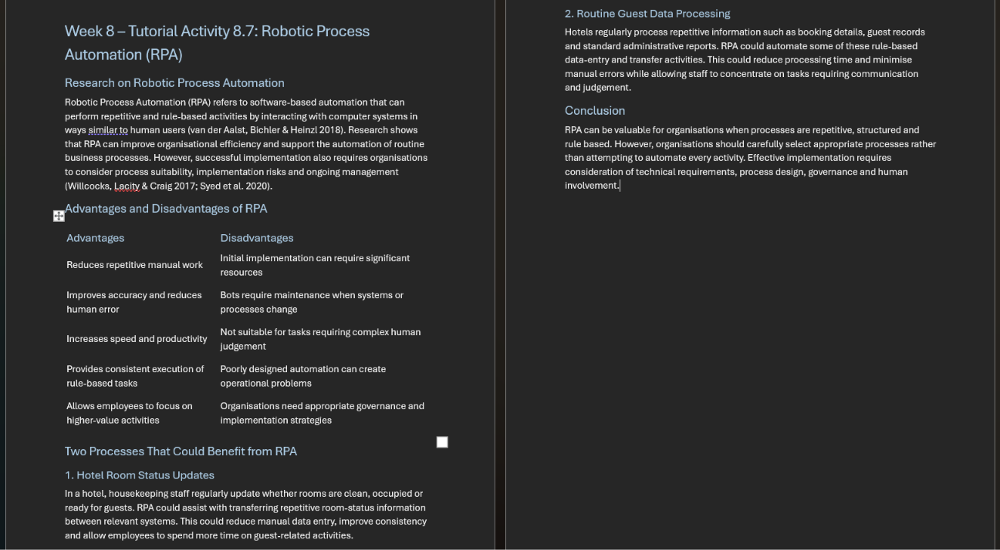
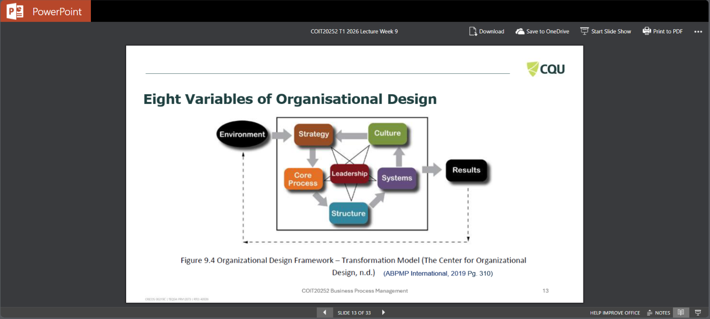

# Robotic Process Automation and Process Cybersecurity
## Week 8-Artifact 8
### Artifact Title: Evaluating the Benefits and Limitations of Robotic Process Automation
### Screenshot of Tutorial Question 8.7

### Screenshot of Robotic Process Automation (RPA) – Benefits, Limitations and Applications

### Reflection
For this week i have selected tutorial question 8.7. Robotic Process Automation (RPA) uses software robots to perform repetitive and rule-based business 
activities. With the help of this activity, I learned that RPA can improve productivity, minimise manual errors and help staff to concentrate on activities that 
need decision-making and interaction. Although, RPA also has some drawbacks which includes initial costs, maintenance requirements and complexity managing 
activities that often change and need human judgement. This artefact helped me to connect RPA concepts with practical business processes. For instance, in a 
hotel, repeated tasks such as updating room information and handling regular administrative data could potentially be automated. I learned that because 
technology is accessible easily, organisations should not automate every process. Instead, they must first examine whether the process is repeated, consistent 
and appropriate for automation. This developed my understanding of how RPA contributes business process improvement.

### References
For this one, we should not make up three journal references. Since Question 8.7 specifically says “Research three journal articles,” the final Week 8 submission 
should contain three genuine academic sources, formatted in CQU Harvard style, and the reflection should use the relevant page-number citations.

## Week 9-Artifact 9
### Artifact Title: Organisational Design Framework – Transformation Model
### Screenshot of Slide 13 

### Reflection
For this week's artefact, I have selected Slide 13 – Eight Variables of Organisational Design from the Week 9 lecture slides. The Organisational Design Framework 
helped me learn how various components of an organisation are linked. The model shows that to influence organisational outcomes, strategy, culture, leadership, 
core processes, systems and structure operate together. It also shows that the outside factors can affect these organisational elements and the overall business 
performance. This artefact developed my knowledge of organisational design within Business Process Management. I learned that improving a business process is not 
only about changing the process itself but organisations must also consider their people, leadership, culture, systems and structure which helped me recognise 
why alignment between different organisational elements is important when implementing process changes and achieving sustainable business improvement.

### References
ABPMP International 2019, BPM CBOK® Version 4.0: Guide to the Business Process Management Common Body of Knowledge, Association of Business Process Management 
Professionals.

## Week 10-Artifact 10
### Artifact Title: Four Principles of Lean Management 
### Screenshot of the "Four Principles Lean Management" video 

### Reflection
For this week's artefact, I selected the “Four Principles of Lean Management” video provided in the Week 10 tutorial material. The Four Principles of Lean 
Management helped me in understanding how by concentrating on customer value and minimising unnecessary work, organisations can enhance processes. Lean promotes 
organisations to recognise what customers actually require, arrange tasks efficiently, create steady workflow and continuously enhance processes which can help 
to minimise delays, unnecessary work and the use of resources that provide no value. This artefact improved my understanding of process enhancement because I 
learned that Lean is not simply about lowering expenses but it focuses on increasing value while using resources effectively. As well as, I understood that 
continuous improvement requires employees to regularly identify problems and look for better ways of completing work. These principles can help organisations 
improve efficiency, quality and customer satisfaction.

### References
Week 10 Tutorial Material 2026, Four Principles of Lean Management, COIT20252 Business Process Management, CQUniversity.

